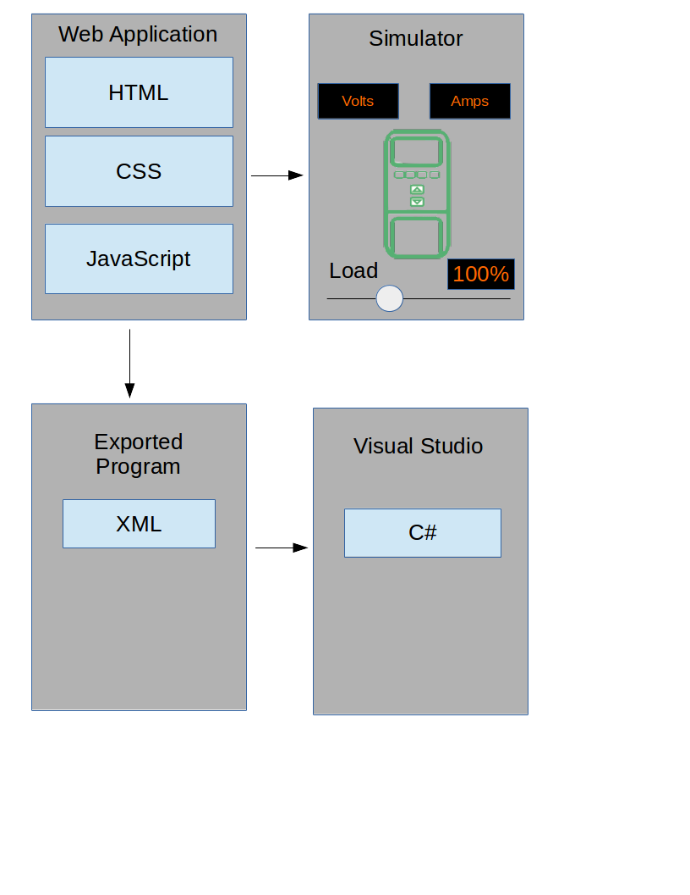

# Baker-Hughes-Web-App

As the next generation of variable speed drives (VSDs) are developed, we require achange in the menu system that must pass newer more stringent standards. The currentgeneration of operating systems being used is not compatible with newer technologies andrequires an update. The next generation of variable speed drives requires programming to makethe systems more automated. To achieve an easier transition, a graphical web application will becreated to simplify the programming process. The web application will include a simulator to testthe programming. The web application will also be able to export the program to an XML file foruse with other Visual Studio projects designed to program a drive. The program will complywith StyleCop static tests which tests if our code is consistent with standardized C# style rules.This application requires that the user understand the limitations of the VSD and the job it isused for. The web application is accessible and usable on any device that has an HTML5compliant browser. The operator is also limited to program on current generation devices,meaning this web application nor the programs it produces is not backwards compatible witholder variable speed drives.

